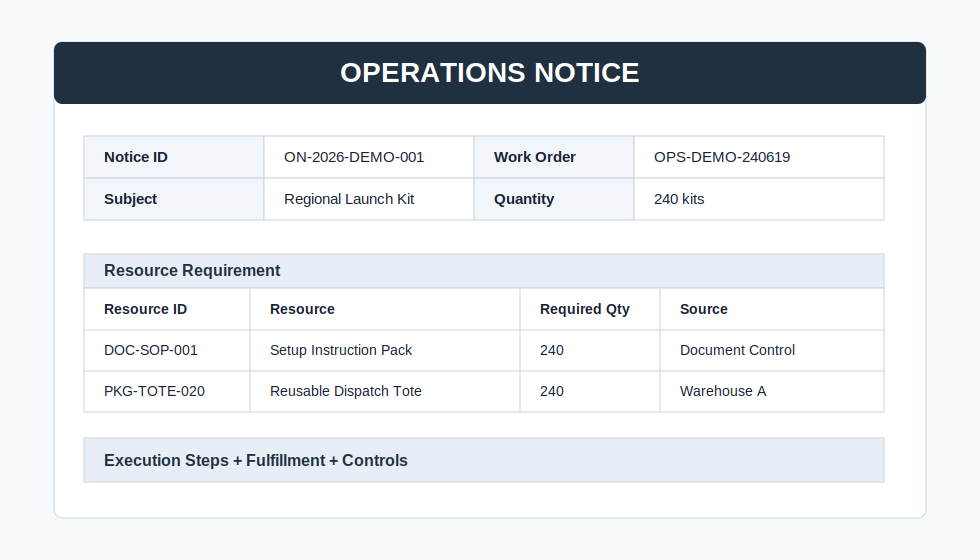
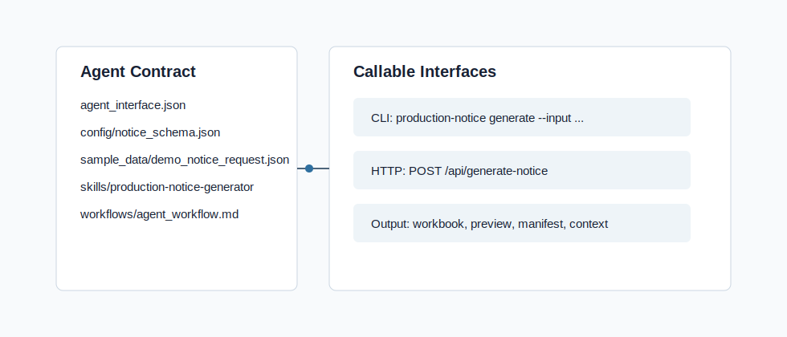

# Structured Operations Notice Agent

Local-first work-package generator for teams that need a repeatable notice,
review, and release workflow. The repository keeps the original
`factory-production-notice-agent` name for continuity, but the public contract is
now generic enough for manufacturing release, warehouse fulfillment,
maintenance, field service, and compliance review scenarios.



## What It Does

- Turns a structured JSON request into an Excel workbook, browser preview,
  manifest, and agent-readable context.
- Supports generic `subject`, `resources`, `steps`, `fulfillment`, and
  `controls` fields while preserving legacy manufacturing aliases.
- Keeps generated artifacts local by default and keeps final release behind a
  human approval gate.
- Exposes both CLI and local HTTP entry points for workflow automation demos.
- Uses only synthetic public sample data.

## Public Demo Contract

The preferred v0.2 contract is intentionally cross-domain:

```json
{
  "notice_id": "ON-2026-DEMO-001",
  "notice_type": "Operations Notice",
  "domain": "warehouse-fulfillment",
  "work_order": "OPS-DEMO-240619",
  "subject": {"subject_id": "KIT-LAUNCH-240", "name": "Regional Launch Kit"},
  "quantity": 240,
  "quantity_unit": "kits",
  "resources": [],
  "steps": [],
  "fulfillment": {},
  "controls": {}
}
```

Legacy keys still work:

```text
product -> subject
materials -> resources
routing -> steps
packaging -> fulfillment
quality -> controls
```

## Run From a Fresh Checkout

```powershell
py -m venv .venv
.\.venv\Scripts\python -m pip install -r requirements.txt
.\.venv\Scripts\python -m pip install -e .
.\.venv\Scripts\python -m factory_production_notice.cli run-demo --output output
```

Open the generated preview:

```powershell
start output\ON-2026-DEMO-001-KIT-LAUNCH-240.html
```

Or use the packaged helper:

```powershell
scripts\run_demo.cmd
```

## Generate From JSON

```powershell
python -m factory_production_notice.cli generate --input sample_data\demo_notice_request.json --output output
```

Additional synthetic scenarios:

```text
sample_data\legacy_manufacturing_notice_request.json
sample_data\maintenance_notice_request.json
```

## Local API

```powershell
python -m factory_production_notice.cli serve --host 127.0.0.1 --port 8765 --output output
```

```text
GET  /health
GET  /agent-interface
POST /api/generate-notice
POST /api/generate-operations-notice
```

`/api/generate-notice` remains for compatibility. New integrations should use
`/api/generate-operations-notice`.

## Agent Contract

```powershell
python -m factory_production_notice.cli agent-spec --output output\agent_interface.json
python -m factory_production_notice.cli analysis-context --input sample_data\demo_notice_request.json --output output\analysis_context.json
```



## Validation

```powershell
python -m pytest -q
```

The test suite can run directly from a fresh checkout because `pyproject.toml`
adds `src` to the pytest import path.

## Product Materials

- [Changelog](CHANGELOG.md)
- [Roadmap](ROADMAP.md)
- [Architecture](docs/ARCHITECTURE.md)
- [Operations playbook](docs/OPERATIONS_PLAYBOOK.md)
- [Privacy and sanitization notes](docs/PRIVACY.md)
- [Agent workflow](workflows/agent_workflow.md)

## Structure

```text
factory-production-notice-agent/
  agent_interface.json
  config/
  docs/
  sample_data/
  scripts/
  skills/
  src/factory_production_notice/
  tests/
  workflows/
```

## License

MIT.
