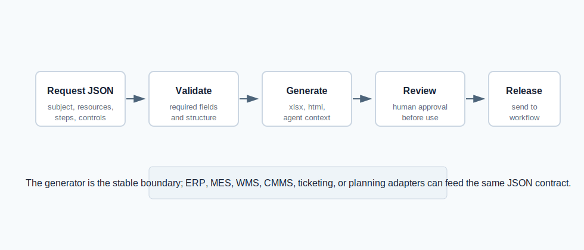
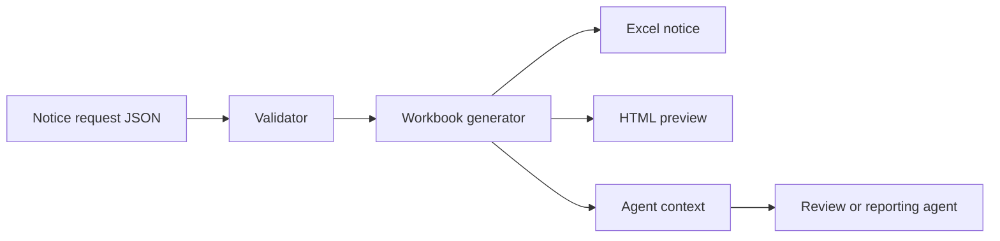

# Factory Production Notice Agent

A small local-first toolkit for generating production notice workbooks from
structured manufacturing requests.

The project is designed for factories that still coordinate production release
through spreadsheet-like templates. It turns a standard JSON request into a
styled Excel notice, an HTML preview, a manifest, and a structured context file
that another agent can inspect without reading project internals.

## Highlights

- Generates production notice workbooks without keeping large template copies.
- Uses synthetic demo data only, suitable for public GitHub presentation.
- Produces Excel, HTML preview, manifest, and agent context artifacts.
- Provides a machine-readable agent interface for external automation tools.
- Exposes a small local HTTP API for agent-to-tool integration demos.
- Keeps production BOM files, generated notices, packaged executables, and
  workstation history outside the repository.

## Visual Overview





## Quick Start

```powershell
py -m venv .venv
.\.venv\Scripts\python -m pip install -r requirements.txt
.\.venv\Scripts\python -m pip install -e .
.\.venv\Scripts\python -m factory_production_notice.cli run-demo --output output
```

If `py` is not available, use `python` instead.

Open the generated preview:

```powershell
start output\PN-2026-DEMO-001-FG-AXLE-1001.html
```

For a Windows one-command demo:

```powershell
.\scripts\run_demo.cmd
```

## Generate From JSON

```powershell
python -m factory_production_notice.cli generate --input sample_data\demo_notice_request.json --output output
```

The input contract is documented in:

```text
config/notice_schema.json
sample_data/demo_notice_request.json
```

## Agent Interface

Write the machine-readable project contract:

```powershell
python -m factory_production_notice.cli agent-spec --output output\agent_interface.json
```

Export structured context for a downstream planning, review, or reporting
assistant:

```powershell
python -m factory_production_notice.cli analysis-context --input sample_data\demo_notice_request.json --output output\analysis_context.json
```

Run a local JSON API:

```powershell
python -m factory_production_notice.cli serve --host 127.0.0.1 --port 8765 --output output
```

Available API paths:

```text
GET  /health
GET  /agent-interface
POST /api/generate-notice
```

## Bilingual Showcase

Open the overview page:

```powershell
start docs\showcase.html
```

## Project Structure

```text
factory-production-notice-agent/
  agent_interface.json       Static machine-readable integration contract
  config/                    Request schema and default notice settings
  docs/                      Public showcase page and visual assets
  sample_data/               Synthetic demo request
  scripts/                   Demo runner and clean package helper
  skills/                    Agent-facing usage instructions
  src/factory_production_notice/
                             Reusable Python package and local API
  tests/                     Regression tests for the public demo
  workflows/                 Human-reviewed agent workflow description
```

## Data Flow



## Integration Direction

The current public demo starts with a normalized JSON request. In a production
environment, ERP, MES, WMS, BOM, order, or scheduling adapters can produce that
same request shape, while this project remains the notice-generation boundary.

This keeps the project easy to demonstrate: adapters can change without
rewriting the notice layout, and agents can call the same CLI or HTTP contract.

## Packaging

Create a clean package:

```powershell
python scripts\package_project.py --name factory-production-notice-agent --output output
```

## Security and Privacy

Use demo or masked data only. Keep production BOM files, customer lists,
supplier lists, generated notice archives, SQLite indexes, executable launchers,
and workstation logs outside the source tree.

## License

MIT.
