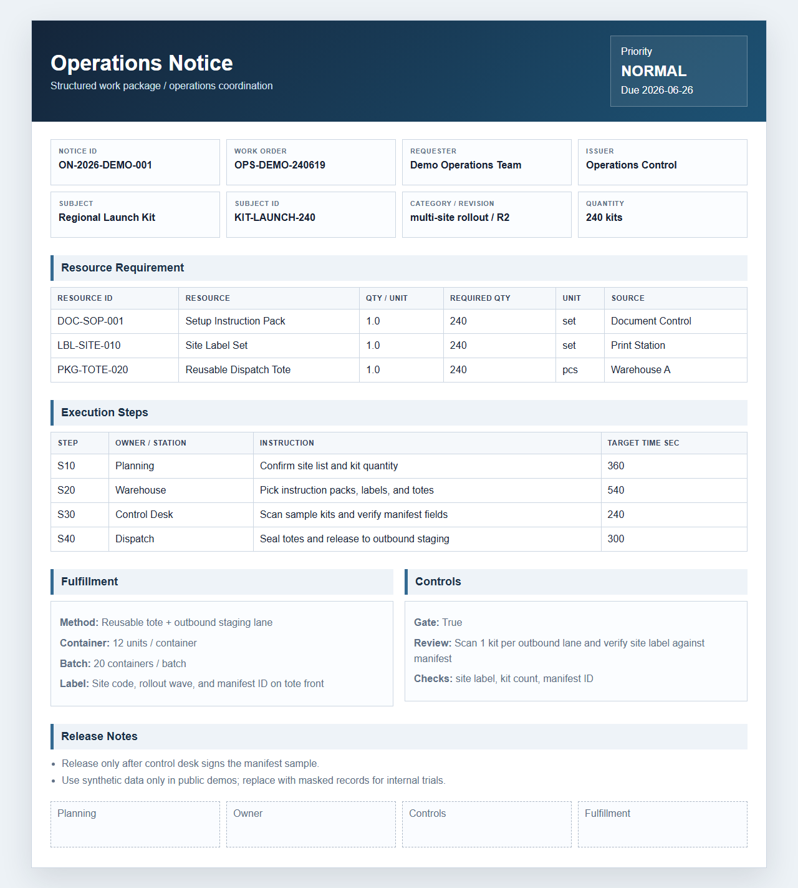
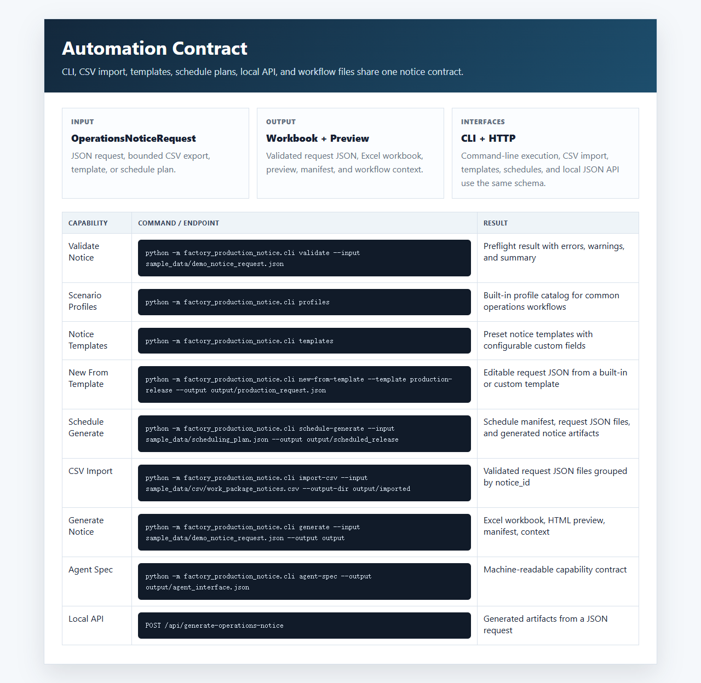

# Factory Production Notice Agent

工厂生产通知单自动化工具



## English

A local-first manufacturing workflow tool that turns a structured work-order
request into a production notice workbook, browser preview, release manifest,
and downstream automation context.

It is built around a stable notice contract: upstream systems provide order,
product, material, routing, packaging, and quality data; the generator owns the
layout, workbook output, preview page, and review-ready artifacts.

Public samples use synthetic manufacturing data only. Replace sample payloads
with sanitized data before adapting the workflow to a real factory process.



### What It Shows

- Production notice generation from a normalized manufacturing request.
- Excel workbook and browser preview output from the same payload.
- Material requirement expansion by order quantity.
- Process routing, packaging, quality, release notes, and approval zones.
- CLI and local HTTP interfaces for workflow automation.
- Agent-readable context for review, reporting, and orchestration.

### Run

```powershell
py -m venv .venv
.\.venv\Scripts\python -m pip install -r requirements.txt
.\.venv\Scripts\python -m pip install -e .
.\.venv\Scripts\python -m factory_production_notice.cli run-demo --output output
```

Open the generated preview:

```powershell
start output\PN-2026-DEMO-001-FG-AXLE-1001.html
```

### Generate From JSON

```powershell
python -m factory_production_notice.cli generate --input sample_data\demo_notice_request.json --output output
```

### Local API

```powershell
python -m factory_production_notice.cli serve --host 127.0.0.1 --port 8765 --output output
```

```text
GET  /health
GET  /agent-interface
POST /api/generate-notice
```

### Agent Contract

```powershell
python -m factory_production_notice.cli agent-spec --output output\agent_interface.json
python -m factory_production_notice.cli analysis-context --input sample_data\demo_notice_request.json --output output\analysis_context.json
```

### Validation

```powershell
python -m pytest -q
```

The test suite can run directly from a fresh checkout because `pyproject.toml`
adds `src` to the pytest import path.

### Structure

```text
factory-production-notice-agent/
  agent_interface.json
  config/
  docs/
  sample_data/
  scripts/
  skills/
  src/factory_production_notice/
  tests/
  workflows/
```

## 中文

这是一个面向制造现场的生产通知单自动化工具。它把结构化工单请求转换成
Excel 生产通知单、浏览器预览、发布清单和可供下游自动化流程读取的上下文。

项目核心是一份稳定的通知单契约：上游系统提供订单、产品、物料、工艺路线、
包装和质检数据，生成器负责版式、工作簿、预览页面和待审核交付物。

### 展示能力

- 从标准制造请求生成生产通知单。
- 同一份数据同时输出 Excel 工作簿和网页预览。
- 按生产数量展开物料需求。
- 覆盖工艺路线、包装、质检、发布备注和审批区。
- 提供命令行和本地 HTTP 接口。
- 输出可被 Agent 读取的结构化上下文，用于审核、报告和编排。

### 快速运行

```powershell
py -m venv .venv
.\.venv\Scripts\python -m pip install -r requirements.txt
.\.venv\Scripts\python -m pip install -e .
.\.venv\Scripts\python -m factory_production_notice.cli run-demo --output output
```

打开生成结果：

```powershell
start output\PN-2026-DEMO-001-FG-AXLE-1001.html
```

### 从 JSON 生成通知单

```powershell
python -m factory_production_notice.cli generate --input sample_data\demo_notice_request.json --output output
```

### 本地接口

```powershell
python -m factory_production_notice.cli serve --host 127.0.0.1 --port 8765 --output output
```

```text
GET  /health
GET  /agent-interface
POST /api/generate-notice
```

### 自动化契约

```powershell
python -m factory_production_notice.cli agent-spec --output output\agent_interface.json
python -m factory_production_notice.cli analysis-context --input sample_data\demo_notice_request.json --output output\analysis_context.json
```

## Showcase

```powershell
start docs\showcase.html
```

## License

MIT.
